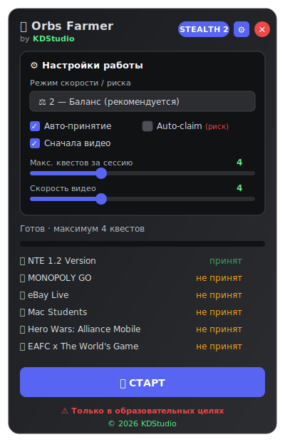

# 🔥 Discord Orbs Farmer v4.1 STEALTH

**ТОЛЬКО В ОБРАЗОВАТЕЛЬНЫХ ЦЕЛЯХ / FOR EDUCATIONAL PURPOSES ONLY**

Этот скрипт создан **исключительно** для изучения внутреннего API Discord, механики квестов и клиентской автоматизации.  
Использование автоматизации квестов **нарушает Terms of Service Discord**.  
Discord с апреля 2026 активно детектит и банит такие действия.  
**Автор, репозиторий и все связанные лица НЕ несут никакой ответственности** за баны, потери аккаунтов, captcha или любые другие последствия.  
Используй **только на свой страх и риск**, желательно на тестовом/альтернативном аккаунте.

---

<p align="center">
  
</p>

> ⚠️ **Educational use only. Risk of permanent Discord ban. You have been warned.**

---

## ✨ Возможности v4.1

- ✅ **Авто-принятие квестов** (JIT — принимает только перед выполнением)
- ✅ **Кнопка СТОП** — останавливает текущий фарм
- ✅ **Кнопка ✕ (Закрыть)** — полностью останавливает скрипт, убирает панель и чистит все spoof'ы
- ✅ Поддержка всех типов квестов (Video / Play / Stream / Activity)
- ✅ **Stealth-режим** 3 уровней
- ✅ Плавающая UI-панель (прогресс, список, Старт/Стоп/Закрыть)
- ✅ Ограничение количества квестов за сессию
- ✅ Большие случайные паузы + медленный «человечный» прогресс
- ✅ Авто-claim выключен по умолчанию
- ✅ Работает в Discord Desktop / Vesktop / Equicord / Vencord

---

## 🚀 Как использовать

1. Открой **Discord Desktop** (или Vesktop / Equicord)
2. Перейди в **Quests**
3. `Ctrl + Shift + I` → **Console**
4. `allow pasting` → Enter
5. Скопируй **полный** код из [`discord-orbs-farm-stealth.js`](./discord-orbs-farm-stealth.js) (raw)
6. Вставь → Enter
7. Появится панель → **СТАРТ**
8. **✕** — полностью закрыть и очистить

Также можно закрыть из консоли: `window.closeOrbsFarmer()`

---

## ⚙️ Основные настройки

```js
STEALTH_LEVEL: 2,              // 1 = быстрее, 2 = баланс, 3 = очень осторожно
MAX_QUESTS_PER_SESSION: 4,
AUTO_ENROLL: true,
AUTO_CLAIM: false,             // лучше вручную
```

---

## ⚠️ Disclaimer (ещё раз)

**FOR EDUCATIONAL PURPOSES ONLY.**  
This project is intended solely for learning how Discord quests and client-side modules work.  
Automating quests is against Discord's Terms of Service.  
The author and this repository take **no responsibility** for any bans, account losses, or other consequences.  
Use at your own risk.

---

## 📜 Лицензия

MIT — do whatever you want, but at your own risk and only for educational purposes.

---

**Сделано для сообщества** · Если помогло — поставь ⭐
